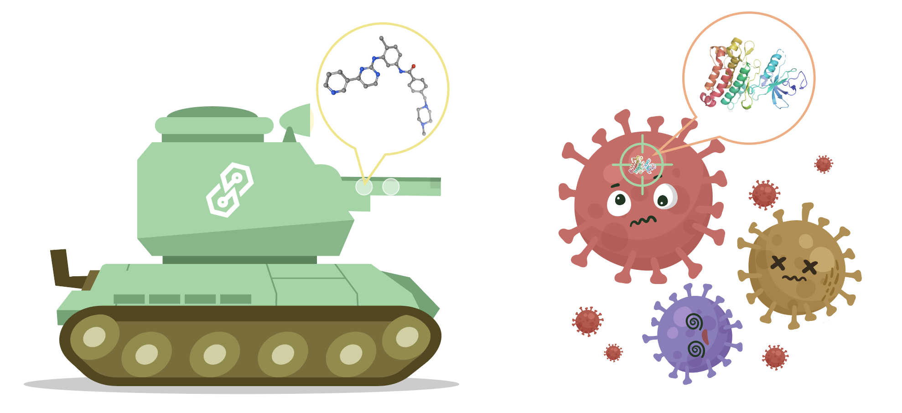
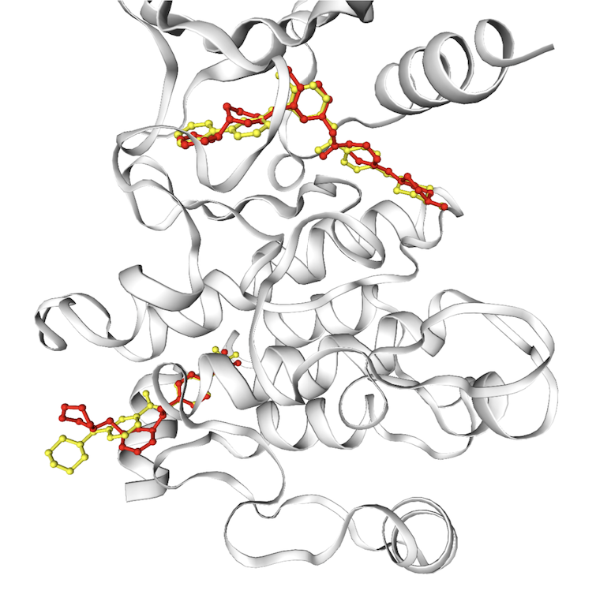

Source code for the *NeurIPS 2022* paper [TANKBind: Trigonometry-Aware Neural NetworKs for Drug-Protein Binding Structure Prediction](https://biorxiv.org/cgi/content/short/2022.06.06.495043v1)

# TankBind
TankBind could predict both the protein-ligand binding structure and their affinity.

The primary purpose of this repository is to enable the reproduction of the results reported in the paper, as well as to facilitate the work of others who wish to build upon it.
To experience the latest version, which includes various improvements made to the model, simply create an account at https://m1.galixir.com/public/login_en/index.html.

If you have any question or suggestion, please feel free to open an issue or email me at [wei.lu@galixir.com](wei.lu@galixir.com) or shuangjia zheng at [shuangjia.zheng@galixir.com](shuangjia.zheng@galixir.com).

## Installation
````
conda create -n tankbind_py38 python=3.8
conda activate tankbind_py38
````
You might want to change the cudatoolkit version based on the GPU you are using.:
````
conda install pytorch cudatoolkit=11.3 -c pytorch
````

````
conda install torchdrug=0.1.2 pyg=2.1.0 biopython nglview jupyterlab -c milagraph -c conda-forge -c pytorch -c pyg
pip install torchmetrics tqdm mlcrate pyarrow
rdkit version used: 2021.03.4
````

p2rank v2.3 could be downloaded from here:

https://github.com/rdk/p2rank/releases/download/2.3/p2rank_2.3.tar.gz


## Test set evaluation
We include the script for reproducing the self-dock result in

    examples/testset_evaluation_cleaned.ipynb

The test_dataset is constructed using the notebook in "Dataset construction" section.


## Prediction
We use the prediction of the structure of protein ABL1 in complex with two drugs, Imatinib and compound6 (PDB: 6HD6) as an example for predicting the drug-protein binding structure. 

    examples/prediction_example_using_PDB_6hd6.ipynb




## Dataset construction
Scripts for training/test dataset construction is provided in:

    examples/construction_PDBbind_training_and_test_dataset.ipynb.ipynb

The Script I used to train the model is 

    python main.py -d 0 -m 0 --batch_size 5 --label baseline --addNoise 5 --use_equivalent_native_y_mask


## High-throughput virtual screening
TankBind also support virtual screening. In our example here, for the WDR domain of LRRK2 protein, we can screen 10,000 drug candidates in 2 minutes (or 1M in around 3 hours) with a single GPU. Check out

    examples/high_throughput_virtual_screening_LRRK2_WDR.ipynb


## Citation
    @article{lu2022tankbind,
    	title={Tankbind: Trigonometry-aware neural networks for drug-protein binding structure prediction},
    	author={Lu, Wei and Wu, Qifeng and Zhang, Jixian and Rao, Jiahua and Li, Chengtao and Zheng, Shuangjia},
    	journal={Advances in Neural Information Processing Systems},
    	year={2022}
    }
